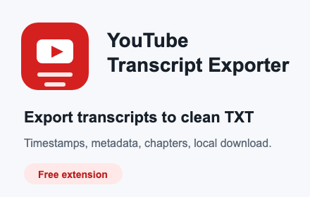
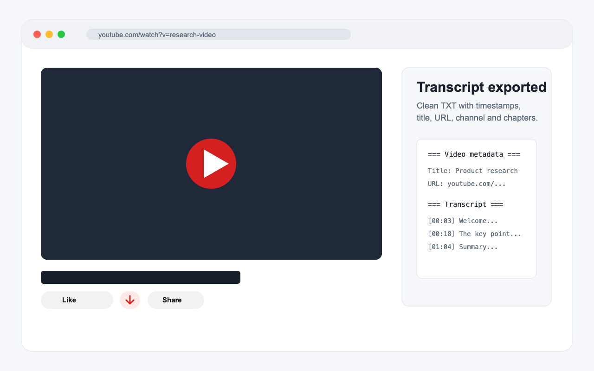
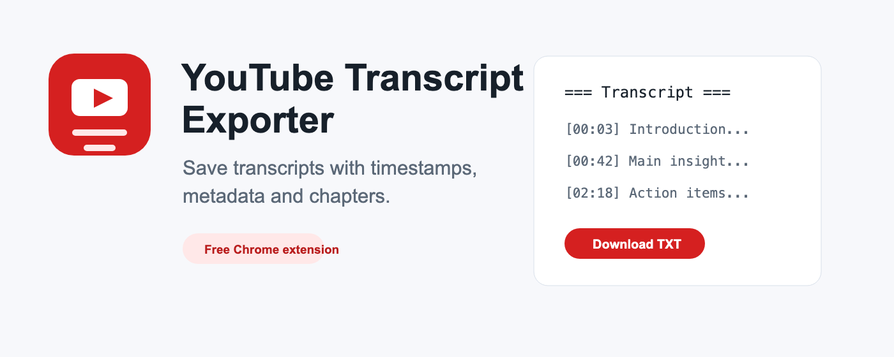

# YouTube Transcript Exporter

Free Chrome extension for exporting YouTube video transcripts to clean local TXT files.



## What It Does

YouTube Transcript Exporter adds a compact export button to YouTube watch pages. Click it to save the current video's transcript as a `.txt` file with timestamps and useful video context.

The exported file can include:

- Timestamped transcript lines
- Video URL and ID
- Title
- Channel name and channel URL
- Subscriber count when visible
- Views, publish/upload dates, duration, category, thumbnail, and tags when available
- Description
- Chapters when YouTube shows them

The extension follows the YouTube/browser interface language when choosing the best available transcript track. If an exact match is unavailable, it falls back to the closest available transcript, then English when available.

## Download

Current version: `1.1.0`

Download the ready-to-load extension package:

https://github.com/x-mp/youtube-transcript-exporter/raw/main/dist/youtube-transcript-exporter-1.1.0.zip

The extension is free.

## Install In Chrome

Until the Chrome Web Store listing is published, install it as an unpacked extension:

1. Download `youtube-transcript-exporter-1.1.0.zip`.
2. Unzip it to a folder.
3. Open Chrome and go to `chrome://extensions`.
4. Enable `Developer mode`.
5. Click `Load unpacked`.
6. Select the unzipped extension folder.
7. Open a YouTube video with an available transcript.
8. Click the export button near the video action buttons.

## Screenshots





## Privacy

Privacy policy:

https://raw.githubusercontent.com/x-mp/youtube-transcript-exporter/main/PRIVACY.md

The extension:

- Runs only on `youtube.com`
- Reads the current YouTube page only to generate the file requested by the user
- Saves the generated file locally through Chrome's Downloads API
- Does not collect analytics
- Does not use ads
- Does not track users
- Does not send, sell, rent, or transfer user data to any external server or third party

## Permissions

`downloads`

Required to save the generated transcript and video metadata as a local `.txt` file when the user clicks the export button.

Host access:

`https://www.youtube.com/*`

Required to read transcript text and visible video metadata from the active YouTube watch page.

## Security

The project does not include server-side code, external analytics, remote API keys, or bundled third-party dependencies.

Security policy:

[SECURITY.md](SECURITY.md)

Before publishing this repository, the files were scanned for common secret patterns such as API keys, bearer tokens, GitHub tokens, passwords, and private keys.

## Chrome Web Store Publication

Suggested settings:

- Item language: English
- Category: Productivity
- Pricing: Free
- Public repository: https://github.com/x-mp/youtube-transcript-exporter
- Privacy policy URL: https://raw.githubusercontent.com/x-mp/youtube-transcript-exporter/main/PRIVACY.md

Store listing materials:

- [store-assets/listing.md](store-assets/listing.md)
- [store-assets/submission-checklist.md](store-assets/submission-checklist.md)
- [store-assets/store-icon-128x128.png](store-assets/store-icon-128x128.png)
- [store-assets/screenshot-1-main-1280x800.png](store-assets/screenshot-1-main-1280x800.png)
- [store-assets/promo-small-440x280.png](store-assets/promo-small-440x280.png)
- [store-assets/promo-marquee-1400x560.png](store-assets/promo-marquee-1400x560.png)

## Local Development

Load the project folder as an unpacked extension:

1. Open `chrome://extensions`.
2. Enable `Developer mode`.
3. Click `Load unpacked`.
4. Select this project folder.

## Build Release Package

Run:

```bash
./build-release.sh
```

The script creates:

```text
dist/youtube-transcript-exporter-1.1.0.zip
```

## Disclaimer

This extension is an independent tool and is not affiliated with, endorsed by, or sponsored by YouTube or Google.
